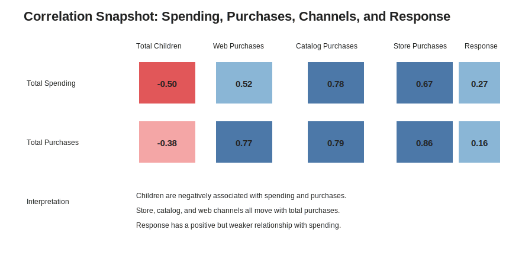
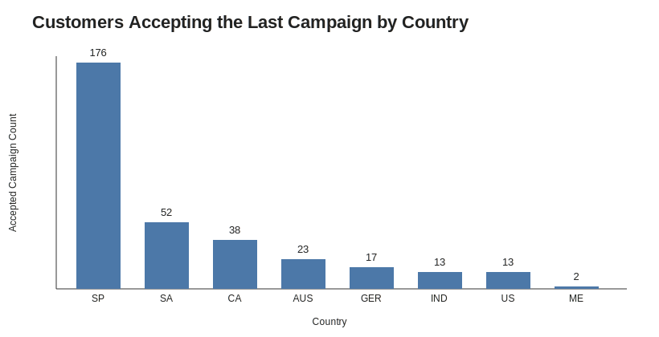
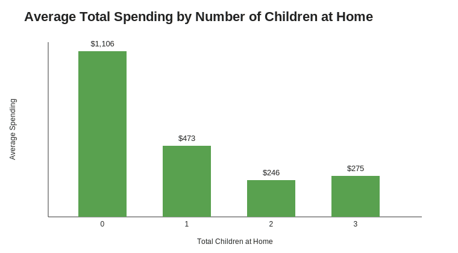
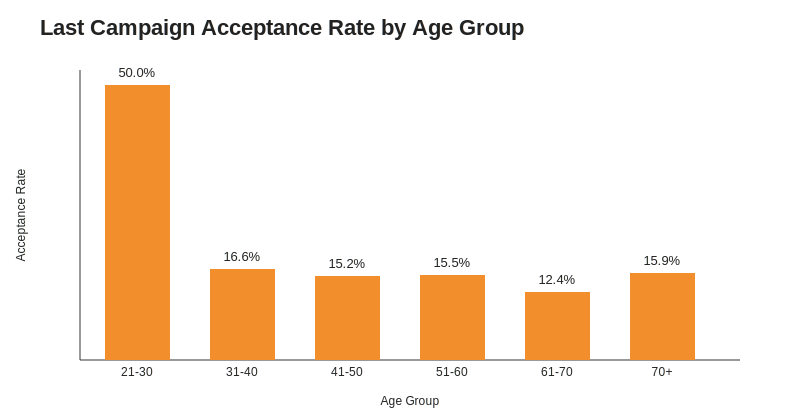

# Marketing Campaign Customer Acquisition Analysis

## Overview

This applied data science project analyzes customer acquisition and marketing performance through the **Four Ps of Marketing: Product, Price, Place, and Promotion**. The analysis uses exploratory data analysis, feature engineering, missing-value treatment, categorical encoding, correlation analysis, hypothesis testing, and business-focused visualizations to identify factors influencing customer behavior and campaign response.

## Business Questions

- Do older customers prefer in-store purchasing?
- Do customers with children use online shopping more frequently?
- Could alternative channels cannibalize physical-store sales?
- Do U.S. customers outperform the rest of the world in purchase volume?
- Which product categories generate the highest and lowest revenue?
- Is age associated with acceptance of the most recent campaign?
- Which country has the most campaign acceptances?
- Is the number of children at home associated with total spending?
- What is the educational background of customers who submitted complaints?

## Analysis Workflow

1. Data validation and type correction
2. Data cleaning and missing-income imputation
3. Feature engineering: total children, age, total spending, and total purchases
4. Exploratory data analysis and outlier treatment
5. Ordinal and one-hot encoding
6. Correlation analysis
7. Hypothesis testing
8. Business-focused marketing visualizations

## Key Findings

- **Wine is the highest-revenue product category**, followed by meat products.
- Customers with **no children at home** had the highest average total spending.
- Store purchases remain strongly related to total purchase volume.
- Catalog and web purchases also show meaningful positive relationships with total spending.
- Spain had the highest number of customers accepting the last campaign in this dataset.
- Age alone does not clearly separate customers who accepted the last campaign from those who did not.

## Insight Dashboard

### Revenue by Product Category


**Interpretation:** Wine and meat products are the strongest revenue categories, making them priority candidates for targeted promotions and retention campaigns.

### Purchase Channel Correlation



**Interpretation:** Store, catalog, and web purchasing behavior all move with total purchases, supporting an omnichannel strategy rather than a single-channel approach.

### Campaign Acceptance by Country



**Interpretation:** Spain produced the highest number of last-campaign acceptances, making it a useful benchmark market for campaign analysis.

### Children at Home vs. Total Spending



**Interpretation:** Average spending is highest among customers without children at home, suggesting household composition is an important segmentation variable.

### Campaign Acceptance by Age Group



**Interpretation:** Campaign acceptance does not appear to be driven by age alone, so age should be combined with purchase behavior, household composition, and product affinity.

## Executive Recommendations

1. **Prioritize high-revenue product categories.** Use wine and meat product affinity to drive targeted offers.
2. **Segment customers by household composition.** Customers with children and customers without children show different spending behavior.
3. **Preserve an omnichannel strategy.** Store, web, and catalog channels all contribute to customer acquisition and purchase activity.
4. **Use Spain as a campaign-response benchmark.** Compare messaging, offers, and customer mix in Spain against lower-response countries.
5. **Build a high-value customer segment.** Combine spending, channel use, product preference, and campaign-response history for future targeting.

## Repository Structure

```text
marketing-campaign-customer-acquisition-analysis/
├── README.md
├── PROJECT_REPORT.md
├── PROBLEM_STATEMENT.md
├── LICENSE
├── requirements.txt
├── .gitignore
├── data/
│   ├── marketing_data.csv
│   ├── data_dictionary.xlsx
│   └── README.md
├── notebooks/
│   ├── marketing_campaign_customer_acquisition_analysis.ipynb
│   └── README.md
├── figures/
│   ├── product_revenue.png
│   ├── purchase_channel_correlation.svg
│   ├── campaign_acceptance_by_country.svg
│   ├── children_vs_total_spending.svg
│   └── campaign_acceptance_by_age.svg
└── docs/
    ├── analysis_screenshots.docx
    ├── problem_statement.docx
    └── project_write_up.docx
```

## Technologies

Python · pandas · NumPy · Matplotlib · Seaborn · SciPy · scikit-learn · Jupyter Notebook

## How to Run

```bash
git clone https://github.com/brian-gaddy/marketing-campaign-customer-acquisition-analysis.git
cd marketing-campaign-customer-acquisition-analysis
python -m venv .venv
pip install -r requirements.txt
jupyter notebook
```

Open `notebooks/marketing_campaign_customer_acquisition_analysis.ipynb` and run the notebook cells in order.

## Supporting Documentation

- [Project Report](PROJECT_REPORT.md)
- [Problem Statement](PROBLEM_STATEMENT.md)

## Portfolio Relevance

This project demonstrates exploratory data analysis, data wrangling, feature engineering, missing-data imputation, statistical hypothesis testing, customer behavior analytics, marketing campaign analysis, business intelligence, data visualization, and executive-level recommendation development.

## Author

**Brian Gaddy, PMP**  
Project & Program Management | Supply Chain & Operations | Data Analytics & AI
