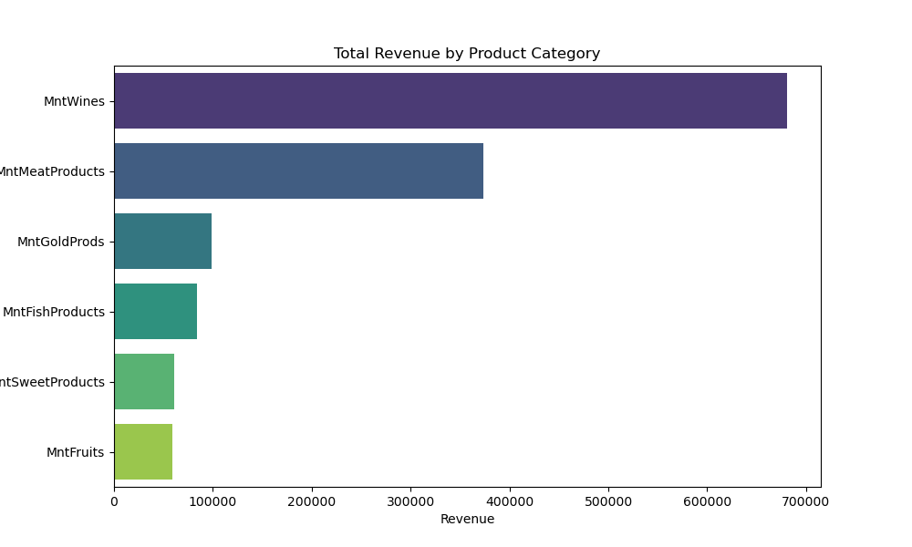

# Marketing Campaign Customer Acquisition Analysis

## Overview

This applied data science project analyzes customer acquisition and marketing performance through the **Four Ps of Marketing: Product, Price, Place, and Promotion**. The analysis uses exploratory data analysis, feature engineering, missing-value treatment, categorical encoding, correlation analysis, hypothesis testing, and business-focused visualizations to identify factors influencing customer behavior and campaign response.

## Business Questions

- Do older customers prefer in-store purchasing?
- Do customers with children use online shopping more frequently?
- Could alternative channels cannibalize physical-store sales?
- Do U.S. customers outperform the rest of the world in purchase volume?
- Which product categories generate the highest and lowest revenue?
- Is age associated with acceptance of the most recent campaign?
- Which country has the most campaign acceptances?
- Is the number of children at home associated with total spending?
- What is the educational background of customers who submitted complaints?

## Analysis Workflow

1. Data validation and type correction
2. Data cleaning and missing-income imputation
3. Feature engineering: total children, age, total spending, and total purchases
4. Exploratory data analysis and outlier treatment
5. Ordinal and one-hot encoding
6. Correlation analysis
7. Hypothesis testing
8. Business-focused marketing visualizations

## Selected Findings

- **Wine is the highest-revenue product category**, followed by meat products.
- Fruit and sweet products are among the lowest-revenue categories.
- Store purchases show a strong relationship with total purchases.
- Total children is negatively associated with total purchases and customer spending.
- Spain shows the highest number of last-campaign acceptances in the analysis.
- Age distributions for customers who accepted and did not accept the last campaign appear broadly similar.

## Revenue by Product Category



## Repository Structure

```text
marketing-campaign-customer-acquisition-analysis/
├── README.md
├── LICENSE
├── requirements.txt
├── .gitignore
├── data/
│   ├── marketing_data.csv
│   ├── data_dictionary.xlsx
│   └── README.md
├── notebooks/
│   ├── marketing_campaign_customer_acquisition_analysis.ipynb
│   └── README.md
├── figures/
│   └── product_revenue.png
└── docs/
    ├── analysis_screenshots.docx
    ├── problem_statement.docx
    └── project_write_up.docx
```

## Technologies

Python · pandas · NumPy · Matplotlib · Seaborn · SciPy · scikit-learn · Jupyter Notebook

## How to Run

```bash
git clone https://github.com/brian-gaddy/marketing-campaign-customer-acquisition-analysis.git
cd marketing-campaign-customer-acquisition-analysis
python -m venv .venv
pip install -r requirements.txt
jupyter notebook
```

Open `notebooks/marketing_campaign_customer_acquisition_analysis.ipynb` and run the notebook cells in order.

## Portfolio Relevance

This project demonstrates exploratory data analysis, data wrangling, feature engineering, missing-data imputation, statistical hypothesis testing, customer behavior analytics, marketing campaign analysis, business intelligence, and data visualization.

## Author

**Brian Gaddy, PMP**  
Project & Program Management | Supply Chain & Operations | Data Analytics & AI
